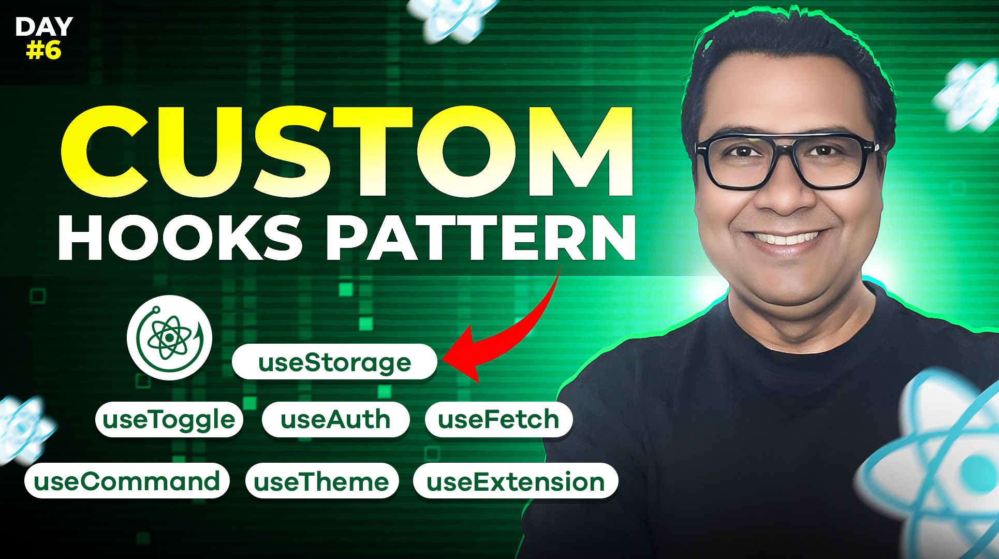

# Day 06 - Custom Hooks Pattern

## **🎯 Goal of This Lesson**

- Day 06
- What Will We Learn?
- Why Hooks?
- What is a Hook in React?
- Built-in Hooks
- Rules of Hooks
- Custom Hooks
- Writing Custom Hooks
- Use Cases
- Pitfalls
- Tasks and Wrapping Up

## 🫶 Support

Your support means a lot.

- Please SUBSCRIBE to [tapaScript YouTube Channel](https://youtube.com/tapasadhikary) if not done already. A Big Thank You!
- Liked my work? It takes months of hard work to create quality content and present it to you. You can show your support to me with a STAR(⭐) to this repository.

    > Many Thanks to all the `Stargazers` who have supported this project with stars(⭐)

### 🤝 Sponsor My Work

I am an independent educator and open-source enthusiast who creates meaningful projects to teach programming on my YouTube Channel. **You can support my work by [Sponsoring me on GitHub](https://github.com/sponsors/atapas) or [Buy Me a Cofee](https://buymeacoffee.com/tapasadhikary)**.

## Video

Here is the video for you to go through and learn:

